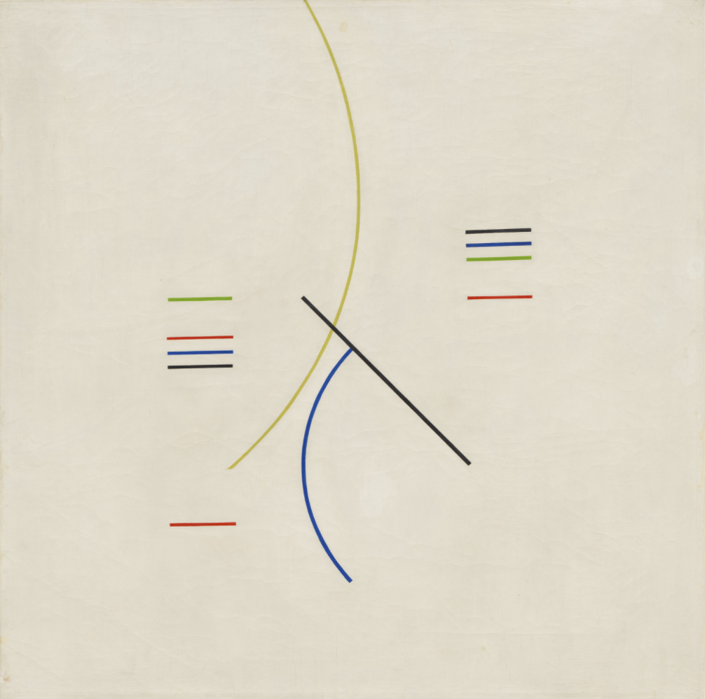
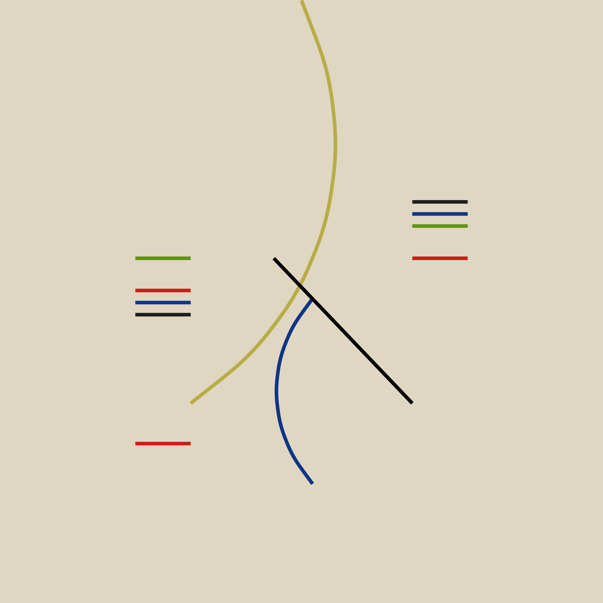
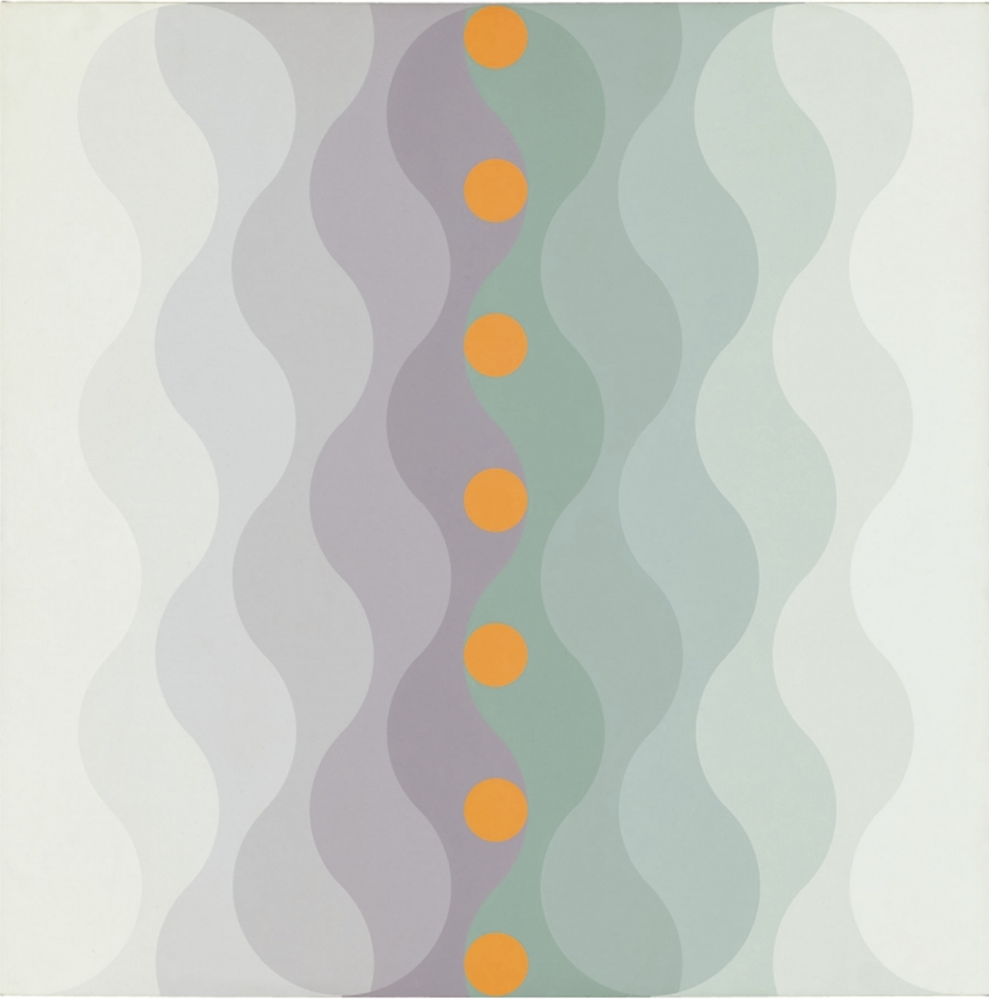
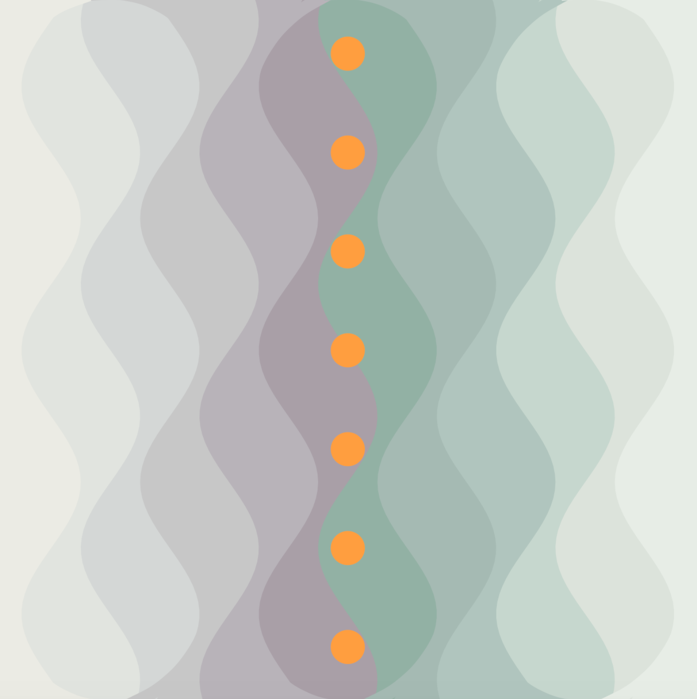
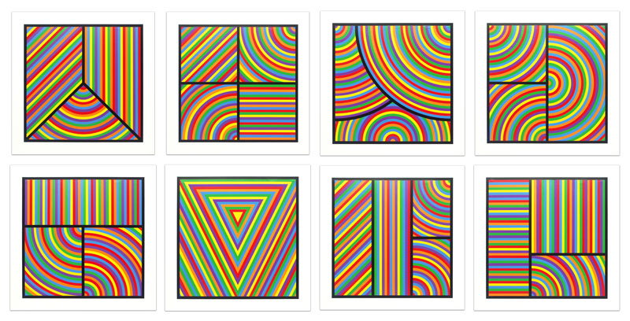
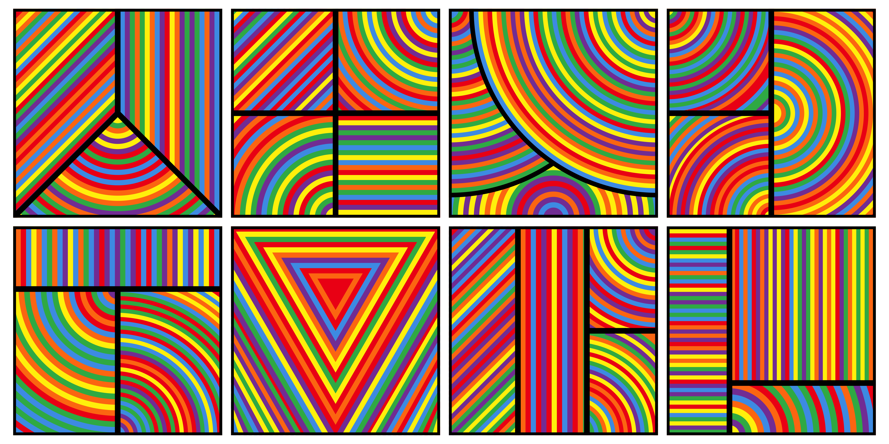
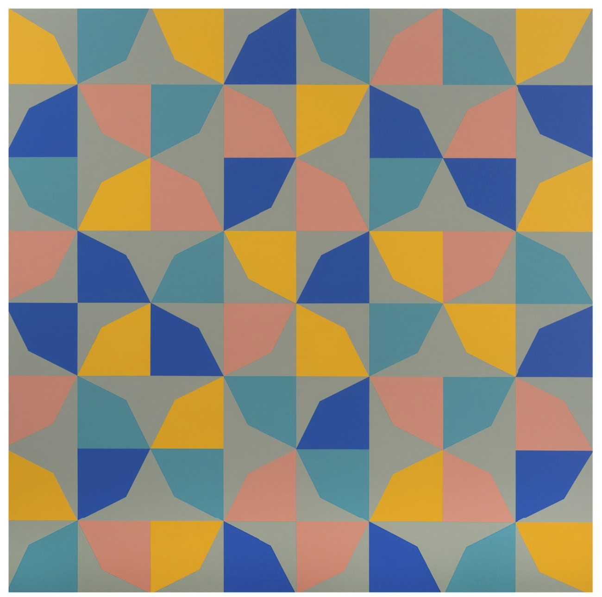
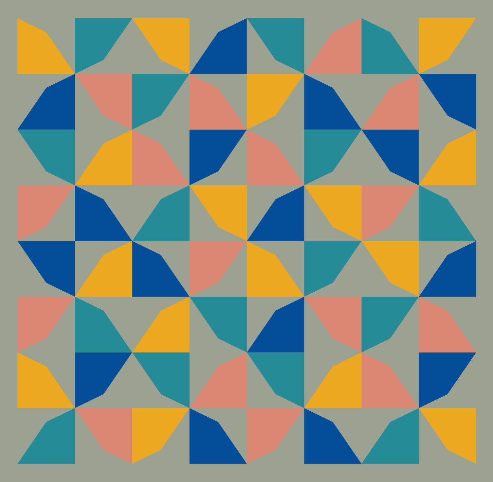
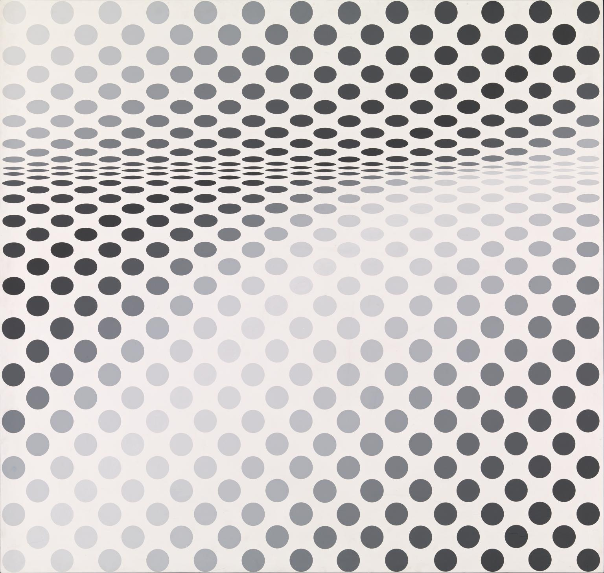
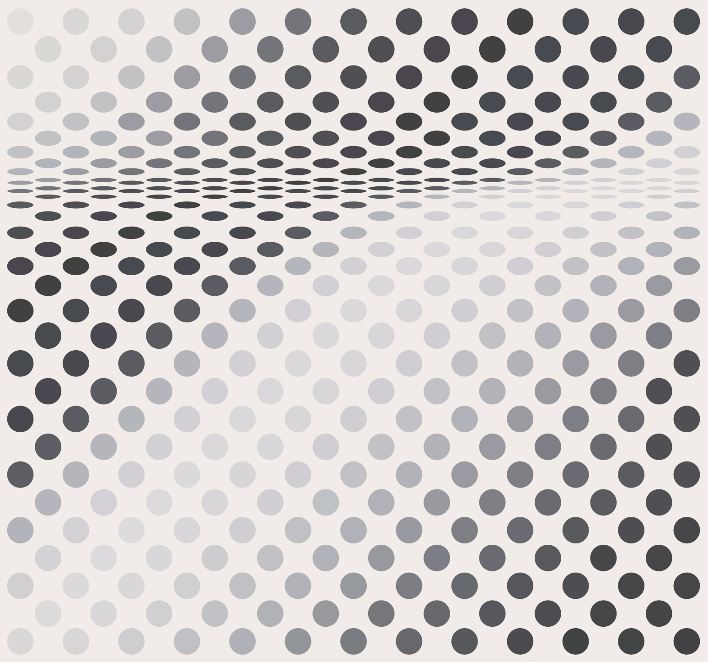

# recreating_art

|  | Original | Recreation |
| ------ | ----| ------- |
| [Alfredo Hilto Curves and Straight Series](https://www.moma.org/collection/works/205953) |  |  
| [Edna Andrade Twilight Wave](https://www.wikiart.org/en/edna-andrade/twilight-wave-1973) |  |  
| [Sol Lewitt Color Bands](https://www.sollewittprints.org/artwork/lewitt-raisonne-2000-07/) |  |  
| [Odili Donald Odita Phantom's Shadow](https://www.sollewittprints.org/artwork/lewitt-raisonne-2000-07/) |  |  
| [Anni Albers Design for a Jaquard Weaving](https://www.artsy.net/artwork/odili-donald-odita-phantoms-shadow) |  |  
| [Bridget Riley Hesitate](https://www.tate.org.uk/art/artworks/riley-hesitate-t04132) |  |  
